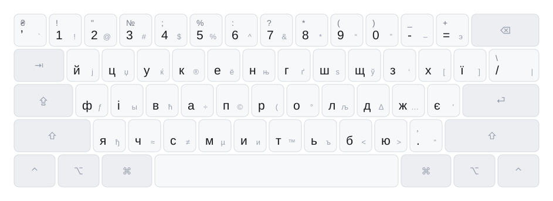

# Ukrainian - Mac PC

A Ukrainian keyboard layout for macOS, forked from the community "Ukrainian - PC"
layout with two keys changed.

<picture>
  <source media="(prefers-color-scheme: dark)" srcset="docs/images/layout-combined-dark.svg">
  
</picture>

Each keycap shows the unmodified character large, the shifted character above it
where shift does more than capitalise, and the ⌥ option character small on the
right. Every layer has [its own diagram](docs/layers.md).

## What differs from upstream

Not a strict superset — two keys move, so muscle memory from "Ukrainian - PC"
transfers everywhere except here:

| Key | Upstream | Here |
| --- | --- | --- |
| `` ` `` (keycode 50) | `'` U+0027 apostrophe | **`ʼ` U+02BC** modifier letter apostrophe |
| `\|` (keycode 42) | `\` base, `/` on shift | **`/` base, `\` on shift** |

U+02BC is the typographically correct Ukrainian apostrophe. It is a *letter* to
Unicode rather than punctuation, which is usually what you want — it keeps `пʼять`
a single word for selection and line breaking — but text typed with it will not
match text typed with `'` or `’` under a naive search. ASCII `'` is still on **⇧⌥9**
and `’` on **⇧⌥З**.

Slash is far more common than backslash in ordinary Ukrainian typing, so it takes
the unmodified position. Nothing is lost; both stay on the same key.

Everything else is byte-identical to upstream: exactly five cells differ across the
whole file, all on these two keys, in the base, shift and caps layers. The option,
shift+option, ⌘ and ⌃ layers are untouched. The ⌘ layer is the US ANSI layout key for
key, so every shortcut lands on the same physical key it always did. See
[CHANGELOG.md](CHANGELOG.md).

## Install

Download the latest `Ukrainian-Mac-PC-<version>.zip` from
[Releases](https://github.com/jenkokov/ukrainian-keyboard-layout/releases), then:

```sh
unzip Ukrainian-Mac-PC-*.zip -d ~/Library/"Keyboard Layouts"
```

Log out and back in, then add it under **System Settings › Keyboard › Input Sources ›
Edit › + › Ukrainian**.

macOS only loads keyboard layouts at login, so the logout is not optional. The
layout has its own bundle ID and a negative keyboard id, so it installs alongside
upstream "Ukrainian - PC" rather than replacing it.

### Uninstall

```sh
rm -rf ~/Library/"Keyboard Layouts"/"Ukrainian - Mac PC.bundle"
```

Remove the input source in System Settings as well, then log out — deleting only the
bundle leaves a ghost entry in the input menu.

## Build

```sh
./scripts/build.sh            # -> dist/Ukrainian - Mac PC.bundle + dist/*.zip
./scripts/install-local.sh    # build, then install into ~/Library/Keyboard Layouts
python3 scripts/test_keylayout.py
python3 scripts/render.py src/*.keylayout docs/images    # regenerate the diagrams
```

## Layout

```
layout.conf                          name, bundle ID, language — drives everything
src/Ukrainian - Mac PC.keylayout     the layout itself; edit here (Ukelele opens it)
src/Info.plist.in                    bundle metadata template
src/version.plist.in                 version metadata template
src/icon.icns                        input-menu icon
scripts/keylayout.py                 parser: modifier resolution + key geometry
scripts/validate.py                  structural checks on the keylayout
scripts/render.py                    generates docs/images/*.svg from the keylayout
scripts/test_keylayout.py            unit tests for the resolver and geometry
scripts/build.sh                     assembles dist/*.bundle and the release zip
docs/layers.md                       one diagram per modifier layer
.github/workflows/release.yml        builds on push, publishes a release on v* tags
```

`InfoPlist.strings` is generated at build time, so the layout name lives in exactly
one place.

## Diagrams

The diagrams in `docs/images/` are generated from the `.keylayout` itself, so they
cannot drift from the source. CI regenerates them and fails the build if the
committed SVGs no longer match — a mapping change with a stale diagram does not
merge. Regenerate with:

```sh
python3 scripts/render.py src/*.keylayout docs/images
```

Output is deterministic (no timestamps, no generated ids), so a diff in
`docs/images/` always means a mapping actually changed. Light and dark are separate
files rather than one SVG with a `prefers-color-scheme` query, because GitHub
renders SVGs through an `` where that query does not reliably follow the theme.

## Validation

`scripts/validate.py` runs on every build and checks that `<layout>` points at a
keyMapSet and modifierMap that exist, that key codes are unique within each keyMap,
that every selected `mapIndex` is present, and that referenced actions are defined —
the mistakes that make a layout silently fail to load rather than error visibly.

`scripts/test_keylayout.py` covers the part that fails silently *and* plausibly: the
`modifierMap` resolver. A modifierMap is an ordered match table over the 256 physical
modifier states, not a list of named planes. The tests walk all 256 and pin the
results — no state matches two `keyMapSelect` entries, map 7 absorbs 181 of them, and
exactly one state (every modifier at once) falls through to `defaultIndex`. The
geometry table is pinned by asserting the upper letter row reads `йцукенгшщзхї`, so
an off-by-one fails loudly instead of rendering a subtly wrong picture.

`xmllint` is deliberately not used: `.keylayout` files are XML **1.1**, because they
carry C0 control characters in `output` attributes that XML 1.0 forbids, and libxml2
only implements 1.0. It rejects a perfectly valid layout.

## Editing the layout

Open `src/Ukrainian - Mac PC.keylayout` in [Ukelele](https://software.sil.org/ukelele/)
or any text editor, then regenerate the diagrams. Keep the `name=` attribute in sync
with `LAYOUT_NAME` in `layout.conf` — the build fails loudly if they drift.

The `id="-19217"` on the `<keyboard>` element is deliberately negative and distinct
from the upstream layout's, so both can be installed side by side.

## Troubleshooting

**The layout does not appear after installing.** Nearly always a missed logout, or
two layouts sharing a bundle ID. macOS reads `~/Library/Keyboard Layouts` at login
only.

**It appears but types the wrong characters.** You are probably on the upstream
"Ukrainian - PC" — both are named "Ukrainian" in the input menu. Check the icon, or
remove upstream while you compare.

## Release

```sh
git tag v1.0.0 && git push --tags
```

CI builds on a macOS runner and attaches the zip to the release.

## Provenance

Derived from the "Ukrainian - PC" layout produced with
[Ukelele](https://software.sil.org/ukelele/). Modifications in this repo are MIT
licensed; see [LICENSE](LICENSE).
