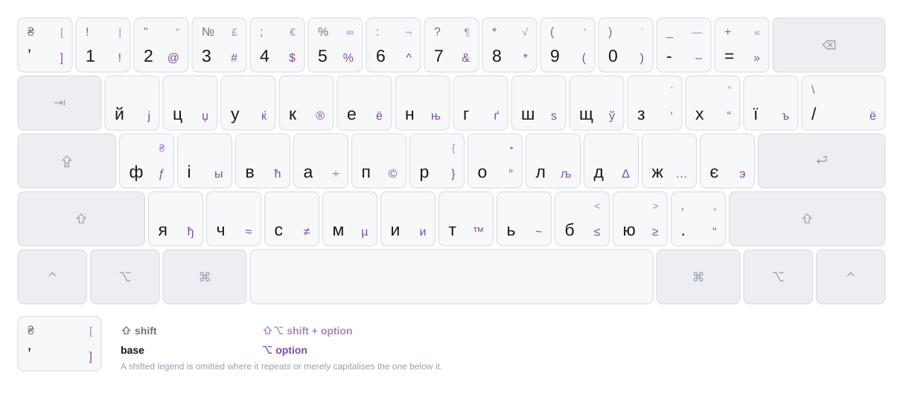

# Ukrainian - Mac PC

A Ukrainian keyboard layout for macOS, for people who also type English and code
all day. The apostrophe is a real Ukrainian apostrophe. Slash needs no shift.
Brackets sit under the same fingers English puts them on, one ⌥ away.

<picture>
  <source media="(prefers-color-scheme: dark)" srcset="docs/images/layout-quad-dark.svg">
  
</picture>

It installs alongside whatever you use now rather than replacing it, so you can
try it and switch back. ⌘-shortcuts are unaffected.

**[Download the latest release →](https://github.com/jenkokov/ukrainian-keyboard-layout/releases)**

## The layout

The base and ⇧ layers are the standard Ukrainian typewriter arrangement — the one
almost every Ukrainian layout uses, and the one your fingers already know. What
this layout does differently is ⌥.

### `ʼ` — a real apostrophe

The `` ` `` key now types **U+02BC ʼ**, the typographically correct Ukrainian
apostrophe, instead of the programmer's quote `'` U+0027.

To Unicode, U+02BC is a *letter* rather than punctuation. That is almost always
what you want in Ukrainian: it keeps `пʼять` a single word, so double-clicking
selects the whole thing and a line break never lands inside it.

The one catch worth knowing: text typed with `ʼ` will not match text typed with
`'` or `’` in a naive search. If you need the others, ASCII `'` is on **⌥Ч** and
`’` on **⇧⌥З**.

### `/` without shift

On the `\|` key, `/` and `\` swap places: **`/` is now unmodified**, `\` is on
shift. Slash is far more common than backslash in ordinary Ukrainian typing.
Nothing is lost — both characters stay on the same key.

### Brackets where English keeps them

**`[` `]` are on ⌥х and ⌥ї, and `{` `}` on ⇧⌥х and ⇧⌥ї.**

Those are the same two physical keys that carry the brackets on a US keyboard —
Cyrillic just put х and ї on top of them. So the bracket you reach for in English
is the bracket you reach for here, with ⌥ held. One position to remember instead
of two.

The same idea runs through the ⌥ layer wherever a key has room: `` ` `` and `~`
on the apostrophe key, `|` on the `/` key, `<` `>` on **Б** and **Ю**.

Where it doesn't have room, the letter wins. `э` stays on **Є**, `ё` on **Е**,
`ъ` on **Ь** — each non-Ukrainian Cyrillic letter sits on the key of its
counterpart, which is a better thing to be able to guess. ASCII `'` and `"` take
**⌥Ч** and **⌥С**.

Maths follows the same instinct where it can: `≈` and `≠` are on **⌥=** and
**⇧⌥=**, next to the `=` they are variations on, and `≤` `≥` sit above `<` `>`.

### Quotes on 9 and 0

**⌥9 ⌥0 give `“` `”`; ⇧⌥9 ⇧⌥0 give `«` `»`.**

Both quote pairs on the same two keys, opening on 9 and closing on 0, the
Ukrainian pair a shift away from the English one. The low `„` for nested quoting
is on the `.` key, with `“` on ⌥ beside it.

### `<` `>` without the extra reach

On the `б` and `ю` keys, ASCII **`<` and `>` are on plain ⌥**; the maths `≤` `≥`
they displaced moved to ⇧⌥. Writing markup or code without leaving the Ukrainian
layout is ordinary. Typing `≤` is not.

### Shortcuts still work

The ⌘ layer is the US ANSI layout, key for key, so every shortcut lands on the
same physical key it does in English — `⌘C` reaches `C`, not `С`. This layout does
not touch it.

### Everything else is still there

The ⌥ layers also carry the non-Ukrainian Cyrillic (`ј џ ќ ё њ ѕ ў ъ ы ћ љ э ђ`),
typographic marks, currency and maths that a Ukrainian layout is expected to have.
Rearranging those layers is routine here; losing something off them is a test
failure, so a character you could type yesterday still types today.

## Install

Download `Ukrainian-Mac-PC-<version>.zip` from
[Releases](https://github.com/jenkokov/ukrainian-keyboard-layout/releases).

### In Finder

1. Double-click the zip. You get **Ukrainian - Mac PC.bundle**.
2. In Finder, press **⇧⌘G** and go to `~/Library/Keyboard Layouts`.
   If that folder doesn't exist, create it — the name has to be exact.
3. Drag the bundle in.

There is no double-click installer for keyboard layouts; copying the bundle into
that folder *is* the installation.

### In Terminal

```sh
ditto -x -k Ukrainian-Mac-PC-*.zip ~/Library/"Keyboard Layouts"
```

(`ditto` rather than `unzip`: it overwrites an existing copy without prompting,
and it doesn't leave a `__MACOSX` folder behind.)

### Either way

**Log out and back in.** macOS only reads keyboard layouts at login, so this step
is not optional.

Then add it under **System Settings › Keyboard › Input Sources › Edit › + ›
Ukrainian**, and pick **Ukrainian - Mac PC**.

## Uninstall

Drag **Ukrainian - Mac PC.bundle** out of `~/Library/Keyboard Layouts` (⇧⌘G in
Finder to get there), or:

```sh
rm -rf ~/Library/"Keyboard Layouts"/"Ukrainian - Mac PC.bundle"
```

Remove the input source in System Settings too, then log out. Deleting only the
bundle leaves a ghost entry in the input menu.

## Troubleshooting

**It doesn't appear in the input source list.** Almost always a missed logout.
macOS reads `~/Library/Keyboard Layouts` at login only.

**It appears but types the wrong characters.** You are probably typing on a
different Ukrainian layout — they all show up as "Ukrainian" in the input menu,
and this one still borrows its icon, so they look alike. Check which is ticked in
System Settings, or remove the other one while you compare.

**An app ignores it.** A few apps request the ASCII-capable layout for shortcuts.
That is macOS behaviour, not something a layout can change.

## Coming from "Ukrainian - PC"?

This started as a fork of that layout, so base and ⇧ are identical to it apart
from two keys: the apostrophe is now `ʼ` rather than `'`, and `/` and `\` swapped
so slash needs no shift.

The ⌥ layers are substantially rearranged — fourteen keys differ in all. Nothing
you could type before became untypeable, but this is **not** a strict superset, so
muscle memory for ⌥ punctuation will need a look at the diagram above.

## Layer diagrams

Each keycap above is a 2×2 grid: left column unmodified, right column ⌥ (tinted);
bottom row unshifted, top row ⇧. A shifted legend is shown only where it does more
than capitalise the one below it.

If you would rather see one layer at a time, **[every layer has its own
diagram](docs/layers.md)** — base, shift, option and shift+option, each with the
keys you hold highlighted.

## Contributing and internals

Build instructions, how the diagrams are generated, and notes on the `.keylayout`
format are in **[docs/development.md](docs/development.md)**. Planned work is in
[ROADMAP.md](ROADMAP.md); what has changed is in [CHANGELOG.md](CHANGELOG.md).

## Credits

Derived from the "Ukrainian - PC" layout produced with
[Ukelele](https://software.sil.org/ukelele/). Modifications in this repo are MIT
licensed; see [LICENSE](LICENSE).
