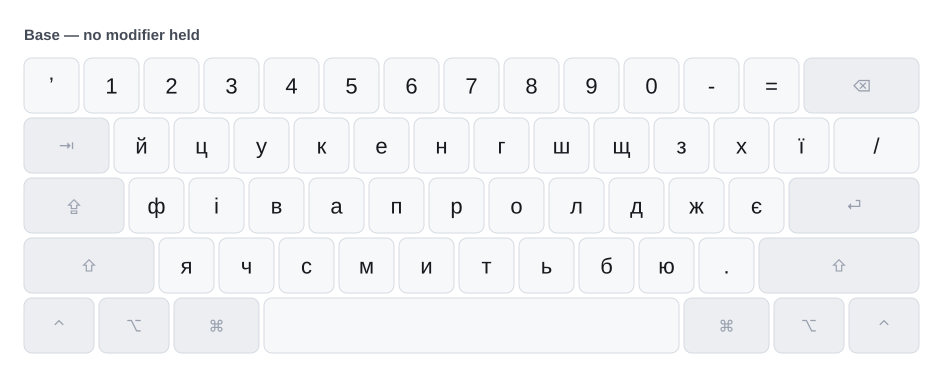
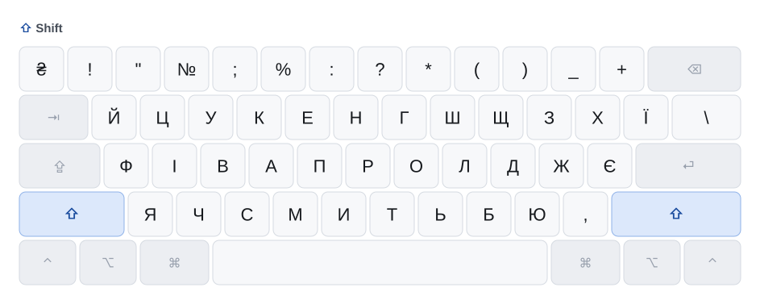
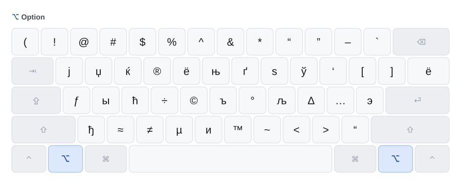
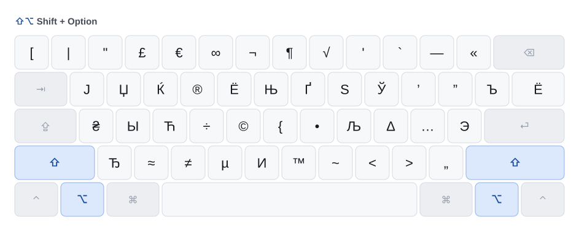

# Layers

One diagram per modifier layer, generated from
`src/Ukrainian - Mac PC.keylayout` by `scripts/render.py`. The keys you hold to
reach a layer are highlighted on each diagram.

Do not edit these by hand — regenerate:

```sh
python3 scripts/render.py src/*.keylayout docs/images
```

## Base

<picture>
  <source media="(prefers-color-scheme: dark)" srcset="images/layout-base-dark.svg">
  
</picture>

The apostrophe on the `` ` `` key is **U+02BC ʼ**, and `/` sits unmodified on the
`\|` key. Those are the only two keys that differ from upstream "Ukrainian - PC".

## Shift

<picture>
  <source media="(prefers-color-scheme: dark)" srcset="images/layout-shift-dark.svg">
  
</picture>

Letters capitalise. The number row carries `₴ ! " № ; % : ? * ( ) _ +`, and `\` is
here on the `\|` key.

## Option

<picture>
  <source media="(prefers-color-scheme: dark)" srcset="images/layout-option-dark.svg">
  
</picture>

Inherited from upstream and untouched by this fork: non-Ukrainian Cyrillic
(`ј џ ќ ё њ ѕ ў ъ ы ћ љ э ђ и`), typographic marks and maths. Worth knowing that
`‘` U+2018 is on **⌥З**, `’` U+2019 on **⇧⌥З**, and ASCII `'` on **⇧⌥9**, if you
need any of them alongside the U+02BC apostrophe.

## Shift + Option

<picture>
  <source media="(prefers-color-scheme: dark)" srcset="images/layout-shift-option-dark.svg">
  
</picture>

Capitalised forms of the option layer, plus currency and the remaining punctuation.

## Layers not shown

The ⌘ and ⌃ layers are deliberately absent. They are Latin passthrough and control
characters respectively — `⌘C` has to reach the `C` key, not `С` — so they are part
of how macOS shortcuts work rather than part of the Ukrainian layout. This fork does
not touch them.

Caps lock is also not shown: it changes letter case only, and leaves every
non-letter key, including the two this fork changes, exactly as the base layer.
`scripts/test_keylayout.py` asserts that.
